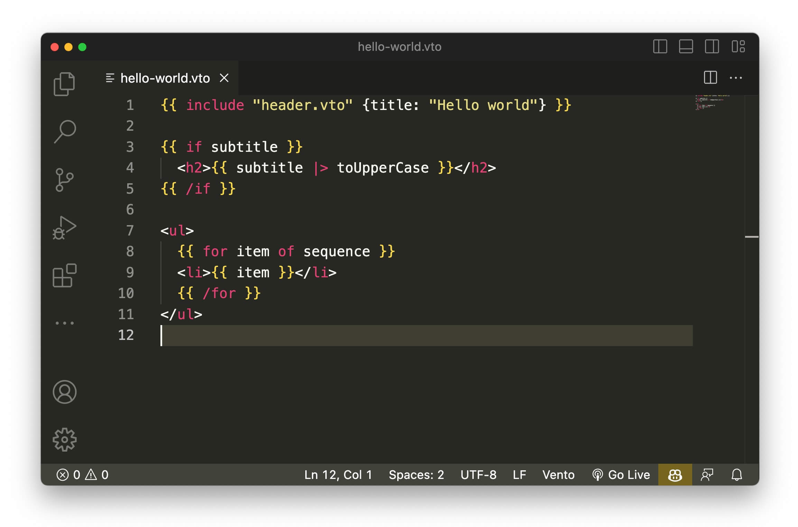

# Vento for Visual Studio Code

Vento template syntax definition with some useful snippets.

<a href="vscode:extension/oscarotero.vento-syntax"><strong>Quick Install</strong></a>

## More information

- [Visual Studio Code Docs](https://code.visualstudio.com/docs)
- [Vento template engine](https://github.com/oscarotero/vento)
